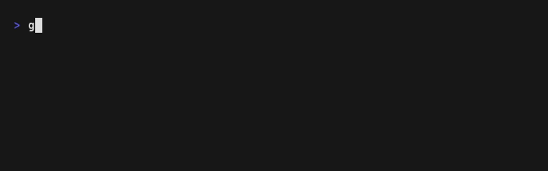
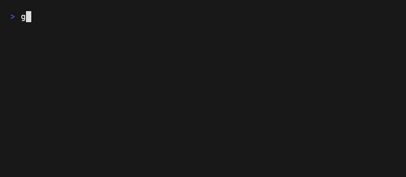

# Bubble Tea Examples

Interactive terminal UI examples powered by `pkg/tui` with the Bubble Tea backend.

## Prompter

### Confirm

Yes/no prompt with configurable default value.

```bash
go run ./pkg/tui/examples/bubbletea/confirm
```


### Text Input

Single-line text input with placeholder, default value, and validation.

```bash
go run ./pkg/tui/examples/bubbletea/textinput
```


### Password

Masked input for sensitive values like tokens and passwords.

```bash
go run ./pkg/tui/examples/bubbletea/password
```



### Select

Single-choice list with arrow key navigation, paging, and loop wrapping.

```bash
go run ./pkg/tui/examples/bubbletea/select
```


### Multi Select

Multi-choice list with space to toggle, min/max constraints, and pre-selected defaults.

```bash
go run ./pkg/tui/examples/bubbletea/multiselect
```


### Editor

Multi-line text editor with initial content. Press `ctrl+d` to submit.

```bash
go run ./pkg/tui/examples/bubbletea/editor
```


## Status

### Spinner

Animated spinner with multiple styles (dot, globe, moon) and dynamic message updates.

```bash
go run ./pkg/tui/examples/bubbletea/spinner
```



### Progress

Animated progress bar with gradient colors, solid fill, and percentage display.

```bash
go run ./pkg/tui/examples/bubbletea/progress
```


### Table

Styled table with auto-calculated column widths and header styling.

```bash
go run ./pkg/tui/examples/bubbletea/table
```


## Generating GIFs

Install [VHS](https://github.com/charmbracelet/vhs) and run from each example directory:

```bash
brew install vhs

cd pkg/tui/examples/bubbletea/spinner
vhs spinner.tape
```
